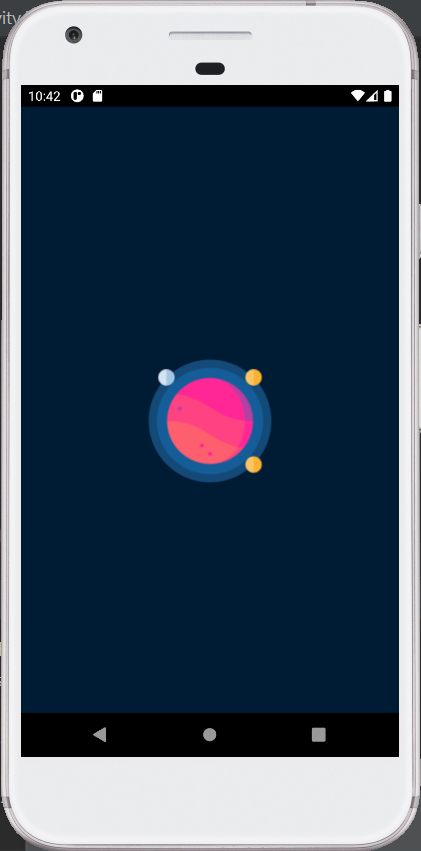
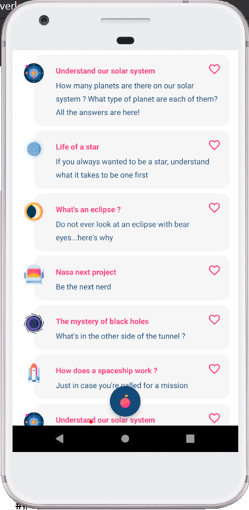
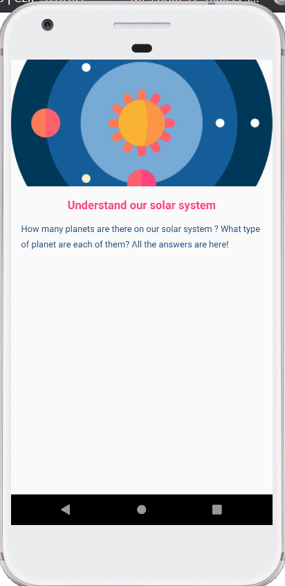
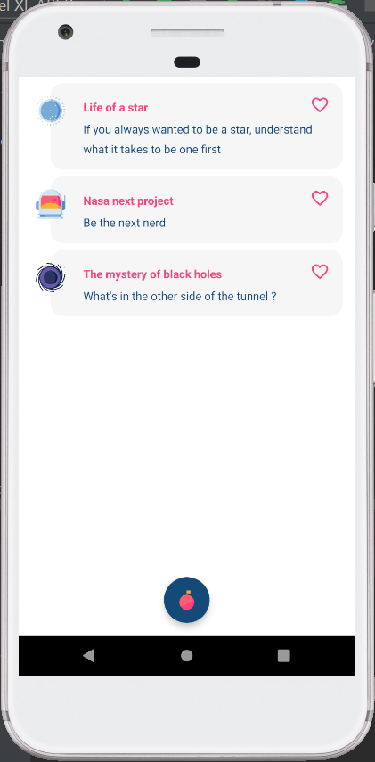
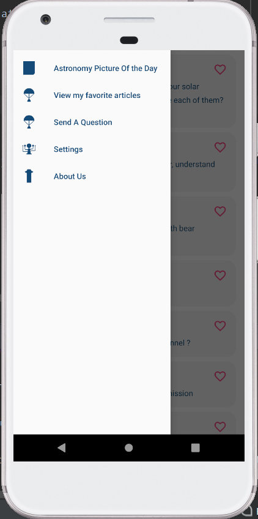
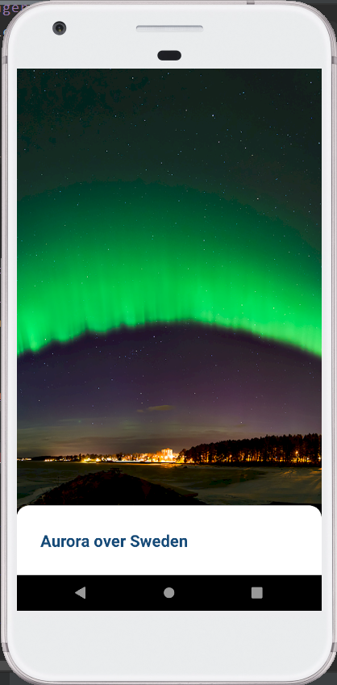
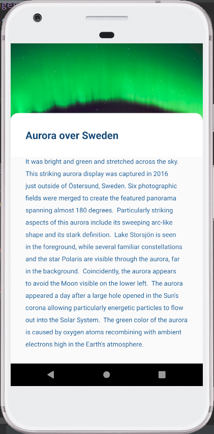

# StarWaze Presentation

The app is for kids who want to understand anything space-related.
Everything in it is explained in simple words.

In term of functionalities:
- Mainly this app displays a bunch of articles easy to read.
- You can add articles to a favorite list, and display them only
- Nasa's Astronomy Picture Of the Day (APOD) API provide One picture a day with an article describing it, displayed in a dedicated functionality

## Respected instructions

* Screens: 2 screens, 2 activity
* Displaying a List of items with Recycler View 
* Displaying details on item click
* Using a Rest API with Retrofit
* Using SharedPreferences to store data

 ## At start
 
  
  
  A brief splash screen while the app is loading.
 
 ## Articles Display
 
 
 
 The first screen showing multiple articles on a RecyclcerView. The scrolling is animated for a better user experience.

 ## On article click
 
 
 
 On an article click you will have the article itself detailed.
 
 ## Saving favourite articles and displaying them
 
 
 
 On the article list screen you can click on the heart image of the item, it will add it to your favorites with the help of  SharedPreferences.
 You can then chose to only display your favourites by clicking on the floating action button. If you want to go back to all the articles you just have to click on the floating button one more time.
 
 ## Drawer menu on left swipe
 
 
 
 Swiping from the left edge of the screen will open a Drawer Menu. You can now click on "Astronomy Picture Of the Day" to get your daily picture and article from Nasa's API
 
 ## Astronomy Picture Of the Day
 
 
 
 This is where you arrive. At the opening of this screen a toast will remind you to rotate your phone to have a wider display of the picture of the day.
 
  If you want to read the article that comes with it you just need to swipe up.
 
 
 
 ## Using
 
 API: [Astronomy Picture Of the Day](https://github.com/nasa/apod-api)

